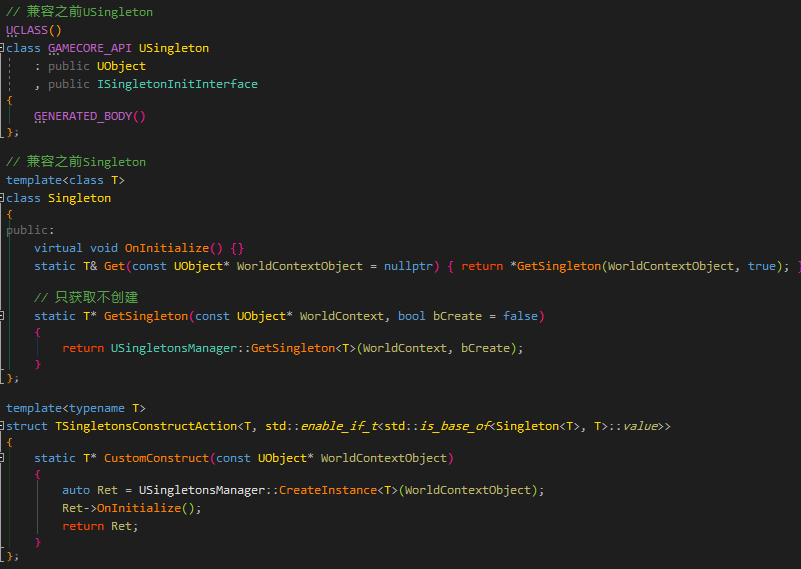

# 介绍
在编程语言中，单例的讨论是泛滥的，C++/Java各种`static`/`volitale`的讨论。

其实单例模式的本质是实现扁平化共享。
由于单例的使用太简化，可能被低水平滥用，单例间依赖也会导致不同的构造和释放顺序，造成释放后还会被访问的问题。
一般而言，在`GC`托管环境中，释放交出去的情况下，可以认为单例仅剩下被滥用的问题，导致多重网状依赖结构而不便于梳理和重构。


首先给出

# 最终方案
```
template<typename T>
static T* GetSingleton(const UObject* WorldContextObject, bool bCreate = true)
```

只需要一个非侵入模板接口，既可以实现单例。做到真正的DRY。

特别的，单例支持绑定到`World`或者绑定到`Instance`：
当`World`/`Instance`销毁时，实例会自动释放`GC`引用。

 `Instance`这个特性可以非常好的解决了PIE的问题。

不需要继承的强依赖，通过接口组合创建/获取的对象即可以当做单例。

针对上述的历史遗留问题也可以完美兼容。

假如需要一些在创建之前做的功能呢，或者创建之后需要一些上下文进行初始化设置的方式呢？
全部的C++层接口如下：


## `GetSingleton`
覆盖了常规的单例功能。

## `RegisterAsSingleton`
对于一些在Level中的实例对象，可以在`PostLoad`/`PostDuplicate`过程中调用，手动把特定对象事先注册为单例。

## `TryGetSingleton`
对于那些创建时有特殊逻辑的，例如上述`OnInitialize`，或者上下文相关逻辑的。通过lambda的强大自定义能力，同样可以很好支持。

## `TryCreateSingleton`
可以针对特定类型定义特定的单例创建流程，主要用来重构以前的接口。
这里说一下`TryCreateSingleton`，利用模板特化，我们可以非侵入的对特定类型实现 `OnInitialize`。
默认模板提供一个默认的创建流程：


对于历史遗留的 `USingleton` 和 `IncSingleton`，可以使用模板（这里用到了void_t）来兼容处理


# 蓝图支持


C++和蓝图类混合，目前的处理方式如下：
将祖先类统一注册一遍，直到第一个`Native`类或者`InNativeClass`。
这样，在一些使用`BP`类实例的情况下，C++层的获取和设置代码亦无需改动。

# 历史手段

## 1. USE `CDO`

了解`CDO`的可能已经知道接下来要说什么了，没错，`GetMutableDefault`，`CDO`拿来就用主义。
缺点：一开始就构造了，不能根据一些情况进行构造，另外，如果`CDO`引用其他`Object`会遇到一些无法绕过的坑。

## 2. `public USingleton`

通过模板成员函数来`USingleton::Get<T>()`，加上虚函数回调， `virtual void OnInitialize() {}`，用来做一些额外的初始化工作。
缺点：由于本身继承了`UObject`，导致无法在`Actor`或者`ActorComponent`这样的类上实现单例。

## 3. `public IncSingleton`

采用`UE4`的`Interface`来破除上述对于继承的限定。

上述单例的初始化都是通过继承的虚函数回调实现.
`virtual void OnInitialize() {}`

## 4. `public TSingleton<T>`

标准`CRTP`，省去`Interface`的额外开销。（`Interface`本身不应该用来干这事）。


最后附上兼容的做法


